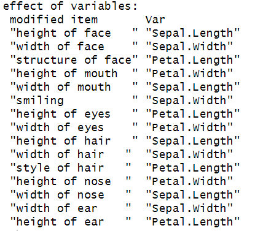

```{r setup, include = FALSE}
options(htmltools.dir.version = FALSE)
library(knitr)
library(tidyverse)
library(xaringanExtra)
library(icons)
library(fontawesome)
library(emo)

# set default options
opts_chunk$set(collapse = TRUE,
               dpi = 300,
               comment = "#",
               message = FALSE,
               warning = FALSE)

knit_engines$set("yaml", "markdown")

xaringanExtra::use_tile_view()
xaringanExtra::use_clipboard()

xaringanExtra::use_panelset()

xaringanExtra::use_share_again()
xaringanExtra::style_share_again(
  share_buttons = c("twitter", "linkedin")
)
xaringanExtra::use_extra_styles(
  hover_code_line = TRUE,         #<<
  mute_unhighlighted_code = TRUE  #<<
)
```

```{r xaringan-editable, echo=FALSE}
xaringanExtra::use_editable(expires = 1)
xaringanExtra::use_scribble()

```

```{r xaringan-themer, include=FALSE, warning=FALSE}
library(xaringanthemer)
style_mono_light(base_color = "#003062")
```


class: title-slide, middle, center
background-image: url(img/LOGOCCM-GRIS.png), url(img/P3.png)
background-position: 50% 10%, 75% 75%
background-size: 15%, cover

.center-column[
# .my-gold[`r rmarkdown::metadata$title`]
### .my-gold[`r rmarkdown::metadata$subtitle`]

####`r rmarkdown::metadata$author` 
#### `r rmarkdown::metadata$date`
]

.white[.left[.footnote[Based in Overleaf template CCM3[Overleaf template CCM3](https://www.overleaf.com/latex/templates/ccm-beamer-template-3/bfqcwdmwkxkx)]]]

---
background-image: url(img/FONDO.png)
background-size: cover
class: middle, center

# `r fontawesome::fa("hat-wizard", fill = "#C99C00")`
# .my-gold[¿Qué tipos de datos/variables existen?]

---
background-image: url(img/FONDO.png)
background-size: cover
class: middle

# .my-gold[Antes de colectar datos]

Debemos establecer todas las variables a medir.

Debemos de garantizar tener control sobre los estándares de medición:

- Como se harán las mediciones: tipo de aparatos, condiciones, unidades, etc.

- Formato de codificación, decimales, código de valores faltantes.

Un grupo de datos de poca o baja calidad no merece un análisis muy detallado.


---
background-image: url(img/FONDO.png)
background-size: cover
# Tipos de variables

.pull-left[.center[

### Cualitativas(categorías)
]
  - Ordinales
  - Nominales

]

.pull-right[.center[
### Cuantitativas(numéricas)
]
  - Discretas
  - Continuas

]

---
background-image: url(img/FONDO.png)
background-size: cover
class: middle

# `r fontawesome::fa("ruler-horizontal")` Escalas de medición 

| Nivel de medición | Definición | Ejemplos|
|-------|-----|------|
|**Nominal** | No asigna orden o jerarquía. Las categorías son exhaustivas y excluyentes. Se puede decir solo si dos categorías son iguales o no. | Grupo sanguíneo, Sexo|
|**Ordinal** | Establecen orden. No existe un intervalo numérico entre las categorías| Escolaridad, Muy bueno,... muy malo, Riesgo: alto > medio > bajo |
|**Intervalo** | Establece un orden por un intervalo numérico. El cero **NO** significa ausencia del valor o la característica. Diferencias iguales en cualquier parte de la escala, reflejan la misma diferencia en la característica medida. | Temperatura: (-10°, 0°, 10°) |
|**Razón** | Existe un intervalo numérico. El cero **Sí** representa la ausencia del valor| Cantidades físicas, ingreso, edad|
|**Absoluta**| Discreta, conteo de elementos, no se pueden hacer cambios de escala ni de origen| Num. de hijos, Partos, Siniestros en una póliza |

---
background-image: url(img/FONDO.png)
background-size: cover
class: middle, center

# `r fontawesome::fa("hat-wizard", fill = "#C99C00")`
# .my-gold[¿Qué son los datos multivariados y el análisis multivariado?]


---
background-image: url(img/FONDO.png)
background-size: cover
class: middle

# .my-gold[Datos multivariados]

  Resulta cuando se alamacenan valores de varias variables aleatorias en varios sujetos u objetos.
  
  Lo que tenemos son observaciones multidimencionales.
  
  Este tipo de datos se colectan en una gran cantidad de disciplinas.
  
  Se pueden representar en un formato rectangular, donde $n$ es el número de variables y $m$ el número de unidades/sujetos/objetos.
  
|Unidad | Variable 1 | $\cdots$ | Variable n |
|---|---|---|---|
|1| $x_{11}$ | $\cdots$ | $x_{1n}$ |
| $\vdots$ | $\vdots$ | $\vdots$ | $\vdots$ |
|m | $x_{m1}$ | $\cdots$ | $x_{mn}$|

---
background-image: url(img/FONDO.png)
background-size: cover
class: middle

# .my-gold[Análisis multivariado]

  En algunos casos tiene sentido estudiar las variables por separado, pero no en general.
  
  Las variables pueden estar relacionadas en menor o mayor grado.
  
  Si cada variable se estudia por separado, podemos perder la estructura completa.
  
  El .my-red[análisis multivariado] es el análisis estadístico simultaneo de una colección de variables que mejora el análisis de cada variable al usar información sobre las relaciones entre las variables. 
  
  Existen métodos de análisis multivariado que son exploratorios y otros que se pueden usar para hacer inferencias.

---
background-image: url(img/FONDO.png)
background-size: cover
class: middle

# Tipos de preguntas en análisis multivariado.

Supongan que tienen un conjunto de datos con medidas de peso, dulzor y acidez de una muestra de frutas (por ejemplo, manzanas, naranjas y plátanos).

 ¿Es posible resumir el "perfil" de sabor y tamaño de la fruta en un solo número combinando estas variables?
 
Sí, este tipo de análisis se puede realizar con .my-red[componentes principales], que condensan varias variables en un nuevo eje o índice que resume la variabilidad más importante.
  
 ¿Existen subtipos de frutas con características de sabor y tamaño similares o muy diferentes?
  
Sí, esto puede explorarse con .my-red[clusters], que permiten agrupar frutas en categorías de acuerdo con sus similitudes.
--


.my-red[NOTA:] Dependiendo del tipo de análisis, la cantidad de frutas evaluadas es importante: mientras más grande la muestra, más robustas y confiables serán las conclusiones.

---
background-image: url(img/FONDO.png)
background-size: cover
class: middle

# `r fontawesome::fa("table")` Covarianzas 

La .my-red[covarianza] entre dos variables aleatorias es una medida de su dependencia lineal. 

Si un conjunto de datos multivariados tiene $n$ variables observadas, entonces existen $n$ varianzas y $n(n-1)/2$ covarianzas. Generalmente estas cantidades se colocan en una matriz simétrica $\Sigma$ de tamaño $n\times n$:


$$\left( \begin{matrix}
\sigma_1^2 & \sigma_{12} & \cdots & \sigma_{1n} \\
\sigma_{21} & \sigma_2^2 & \cdots & \sigma_{2n} \\
\vdots & \vdots & \ddots & \vdots \\
\sigma_{n1} & \sigma_{n2} & \cdots & \sigma_{n}^2 
\end{matrix} \right)$$

Donde $\sigma_{ij}=\sigma_{ji}$. Esta matriz se conoce como la matriz de .my-red[varianzas y covarianzas]. Para un conjunto de observaciones, la matriz $\Sigma$ se estima como:

$$S = \frac{1}{n-1} \sum_{i=1}^{n} (x_{i} - \bar{x}) (x_{i}-\bar{x}) ^{T}.$$
---
background-image: url(img/FONDO.png)
background-size: cover
class: middle

# `r fontawesome::fa("calculator")` Correlaciones

La covarianza es difícil de interpretar en ocasiones debido a que las variables pueden tener escalas muy diferentes de medición. Por esta razón suele .my-red[estandarizarse] dividiendo por el producto de las desviaciones estándar de las dos variables, el resultado de esto se le llama el coeficiente de correlación:

$$\rho_{ij}=\frac{\sigma_{ij}}{\sigma_i \sigma_j}$$
donde $\sigma_i=\sqrt{\sigma_i^2}$. 

La correlación es independiente de las escalas de medición y estos coeficientes están entre $-1$ y $1$ y nos dan una medida de la relación lineal entre las variables $X_i$ y $X_j$. 

Si tenemos $n$ variables, entonces podemos acomodar estos coeficientes en una matriz de tamaño $n\times n$ donde los elementos en la diagonal son $1$. La matriz se puede escribir en términos de la matriz de covarianzas:

$$R=D^{-1/2}SD^{1/2}$$
donde $D^{-1/2}=diag(1/\sigma_1,\dots, 1/\sigma_n)$.

---
background-image: url(img/FONDO.png)
background-size: cover
class: middle

# `r fontawesome::fa("ruler")` Distancias

El concepto de distancia entre datos multivariados es de interés e importante. Dados dos unidades $i$ y $j$, ¿qué nos sirve como medida de distancia? La más común es la Euclideana pero existen muchas más.

Una **similitud** es una medida entre dos objetos de que tanto se parecen. Por lo cual entre más parecidos sean los dos objetos su medida de similitud será más grande. 

Una **disimilitud** entre dos objetos es una medida del grado en el cual dos objetos son diferentes. Una disimilitud debe ser baja si se consideran pares de objetos que son similares.

Toda distancia (o métrica) es una disimilitud, pero no toda disimilitud es una distancia.

Cuando los datos se encuentran en escalas muy diferentes, tiene sentido calcular la distancia después de haber estandarizado los datos. 

En R, existe la función `dis()` para calcular la distancia entre dos objetos.

---
background-image: url(img/FONDO.png)
background-size: cover
class: middle, center

# Plots de matrices de correlación o distancias

En R existen varios paquetes que nos permiten realizar los plots de estas matrices.

```{r}
library(ggcorrplot)
library(corrplot)
```

```{r, eval=FALSE}
cor.mat_all <- cor(data.matrix(iris[,-5]), use="complete.obs")

corplot_all <- corrplot(cor.mat_all, method="shade", tl.col = "black", tl.srt = 45, 
                        number.cex = 0.4, addCoef.col = "black",order = "AOE",type = "upper",addshade = "all", diag = F)
```

---
background-image: url(img/FONDO.png)
background-size: cover
class: middle, center

```{r, echo=FALSE, fig.height=4}
cor.mat_all <- cor(data.matrix(iris[,-5]), use="complete.obs")

corplot_all <- corrplot(cor.mat_all, method="shade", tl.col = "black", tl.srt = 45, 
                        number.cex = 0.4, addCoef.col = "black",order = "AOE",type = "upper",addshade = "all", diag = F)
```
---
background-image: url(img/FONDO.png)
background-size: cover
class: middle, center

# `r fontawesome::fa("chart-bar")` Plots univariados

¿Qué tipos de plots podrías usar para hacer un análisis univariado?

.can-edit.key-likes[ 

-

-

-

-

]

---
background-image: url(img/FONDO.png)
background-size: cover
class: middle

# Plots multivariados

Los plots multivariados tratan de involucrar más de dos variables, hay de varios tipos por ejemplo de símbolos y .my-red[glyph] en los cuales los valores de los datos controlan el parámetro de los símbolos. 

Para el caso de querer representar 3 variables podemos usar el plot de burbujas donde el radio del círculo lo determinaba la tercera variable. 

.my-gold[¿Cómo podemos representar datos de dimensiones muy altas?]

--

Una forma son las matrices de scatterplots que vimos con el comando `pairs` donde tenemos todas las posibles combinaciones de dos a dos variables. Existen modificaciones a este que incluyen las regresiones u otros llamados .my-red[bagplot] (este lo pueden usar en R con el comando `bagplot.pairs(data, gap=, col.baghull= "color")` ).

--

Otros más son:

  - Caritas de Chernoff
  - Curvas de Andrew
  - Estrellas
  - Paralelas
  - 3D
  
---
background-image: url(img/FONDO.png)
background-size: cover
class: middle, center

# Caritas de Chernoff

Publicadas por Herman Chernoff en 1973 en el artículo *The use of Faces to Represent Points in k-dimensional Space Graphically* del Journal of the American Statistical Association.

Estas se basan en el hecho que nuestro ojo puede reconocer los .my-blue[rostros humanos] muy facilmente. Reconocemos a nuestra gente entre miles de caras.
.panelset[
.panel[.panel-name[Código y caritas]
.pull-left[

```{r, eval=FALSE}
install.packages("aplpack")
library(aplpack)
data(iris)
```

```{r, include=FALSE}
library(aplpack)
data(iris)
```

```{r, eval=FALSE}
faces(iris[c(1,51,101),1:4],
      nrow.plot = 1, 
      ncol.plot = 3, 
      main = "La primer flor de cada especie", print.info = TRUE)
```

]

.pull-right[

```{r, fig.height=4,echo=FALSE}
faces(iris[c(1,51,101),1:4],
      nrow.plot = 1, 
      ncol.plot = 3, 
      main = "La primer flor de cada especie")
```

Para los elementos de color de las caras, los colores son encontrados al promediar los conjuntos de variables:  (7,8)-eyes:iris, (1,2,3)-lips, (14,15)-ears, (12,13)-nose, (9,10,11)-hair, (1,2)-face (From `?faces`).
]
]

.panel[.panel-name[Significado]

.pull-left[

```{r, fig.height=5,echo=FALSE}
faces(iris[c(1,51,101),1:4],
      nrow.plot = 1, 
      ncol.plot = 3, 
      main = "La primer flor de cada especie", print.info = TRUE)
```

]

.pull-right[



]

]
]

---

class: middle, center, inverse

.my-gold[`r fontawesome::fa("code", height = "3em")`]
# .my-gold[Práctica:] 
### .my-gold[Carga la base de datos y explora las caritas de Chernoff]

---
background-image: url(img/FONDO.png)
background-size: cover
class: middle

# Curvas de Andrews

Se basa en el trabajo de Andrews de 1972 *Plots of High Dimensional Data*, Biometrics, vol. 28, no. 1, pp. 125-136.

Si $x_i=(x_{i1}, x_{i,2}, \dots, x_{ip})$ es la observación $i$ ésima, entonces se transforma en una curva de la forma:

Si $p$ es par:

$$f_i(t)= \frac{x_{i1}}{\sqrt{2}} + x_{i2}\sin(t)+x_{i3}\cos(t)+x_{i4}\sin(2t)+x_{i5}\cos(2t)+\cdots+x_{ip}\sin(\frac{p}{2}t)$$

y si $p$ es impar en:

$$f_i(t)= \frac{x_{i1}}{\sqrt{2}} + x_{i2}\sin(t)+x_{i3}\cos(t)+\cdots+x_{ip}\cos(\frac{p-1}{2}t)$$

y los valores de $t\in(0,2\pi)$.

---

background-image: url(img/FONDO.png)
background-size: cover
class: middle

La distancia entre dos curvas es el área entre ellas y será igual a la distancia entre las observaciones. Permite detectas grupos. Si las observaciones son lejanas entonces las funciones también. Si se usan en diferente orden las variables, entonces se producen curvas diferentes.

En R, el paquete para graficar estas curvas es `andrews` y tiene integradas 5 funciones más para estás curvas. Explora la ayuda del paquete para ver estas curvas.

Dependiendo del orden de las variables se pueden ver mejor las separaciones de los grupos.

Se pueden meter muchos más individuos a diferencia del de caritas de Chernoff. 

Este tipo de graficos y el de caritas de Chernoff nos ayuda a representar muchas dimensiones en $\mathbb{R}^2$.

---
class: middle

.pull-left[
```{r, include=FALSE}
library(andrews)
```


```{r, eval=FALSE}
library(andrews)
par(mfrow=c(2,2))
andrews(iris, type = 1, clr = 5, ymax = 3, main = "Curva tipo 1")
andrews(iris, type = 2, clr = 5, ymax = 3, main = "Curva tipo 2")
andrews(iris, type = 3, clr = 5, ymax = 3, main = "Curva tipo 3")
andrews(iris, type = 4, clr = 5, ymax = 3, main = "Curva tipo 4")

```
]

.pull-right[
```{r, echo=FALSE,fig.height=7}
par(mfrow=c(2,2))
andrews(iris, type = 1, clr = 5, ymax = 3, main = "Curva tipo 1")
andrews(iris, type = 2, clr = 5, ymax = 3, main = "Curva tipo 2")
andrews(iris, type = 3, clr = 5, ymax = 3, main = "Curva tipo 3")
andrews(iris, type = 4, clr = 5, ymax = 3, main = "Curva tipo 4")

```
]

---

class: middle, center, inverse

.my-gold[`r fontawesome::fa("code", height = "3em")`]
# .my-gold[Práctica:] 
### .my-gold[Carga la base de datos y explora las curvas de Andrews]

---
background-image: url(img/FONDO.png)
background-size: cover

# Gráficos de Paralelas

Usualmente graficamos ejes perpendiculares, este no es el caso de los plots de paralelas, en este caso se consideran ejes paralelos para cada variable. Usualmente los datos se reescalan de tal forma que todos tengan la misma escala. Los valores multidimensionales para cada observación se conectan con lineas que podemos seguir a lo largo de todas las dimensiones.

```{r, eval=FALSE}
library(lattice)
data(mtcars)
parallelplot(~mtcars|mtcars$cyl, main="Plot de paralelas por Cilindros")
```

---

```{r, echo=FALSE, fig.height=4}
library(lattice)
data(mtcars)
parallelplot(~mtcars|mtcars$cyl, main="Plot de paralelas por Cilindros")
```

---

class: middle, center, inverse

.my-gold[`r fontawesome::fa("code", height = "3em")`]
# .my-gold[Práctica:] 
### .my-gold[Carga la base de datos y explora los plots de paralelas]


---
background-image: url(img/FONDO.png)
background-size: cover

# Estrellas

La función `stars` del paquete de `graphics` nos permite realizar plots de estreyas o radares para representar datos multivariados, las variables se mandan a las longitudes de los rayos y cantidad de estos.

```{r, eval=FALSE}
palette(rainbow(12, s = 0.6, v = 0.75))
stars(mtcars[, 1:7], len = 0.8, key.loc = c(12, 1.5),
      main = "Motor Trend Cars", draw.segments = TRUE)
```

---
```{r, echo=FALSE, fig.height=4}
palette(rainbow(12, s = 0.6, v = 0.75))
stars(mtcars[, 1:7], len = 0.8, key.loc = c(12, 1.5),
      main = "Motor Trend Cars", draw.segments = TRUE)
```

---

class: middle, center, inverse

.my-gold[`r fontawesome::fa("code", height = "3em")`]
# .my-gold[Práctica:] 
### .my-gold[Carga la base de datos y explora las gráficas de estrellas]


---
background-image: url(img/FONDO.png)
background-size: cover
class: middle

# Plots 3D

```{r, echo=FALSE, fig.height=4}
attach(iris)
cloud(Sepal.Length~Sepal.Width*Petal.Length|Species,main="3D Scatterplot IRIS por Especie")
```


